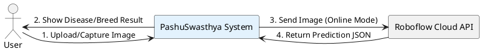
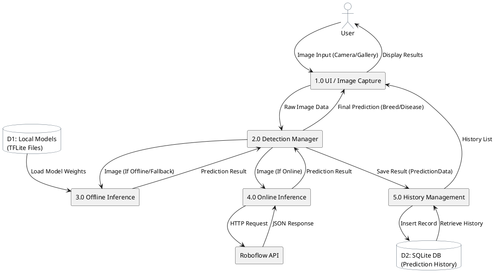

# Data Flow Diagrams (DFD)

## Level 0: Context Diagram

This diagram represents the entire "PashuSwasthya" system as a single process, interacting with external entities.

## Level 1: DFD

This diagram breaks down the system into its major sub-processes and data stores, showing how data flows between them.

### Description of Processes

1.  **UI / Image Capture**: Handles user interaction, camera permissions, and image selection.
2.  **Detection Manager**: The core logic (`BreedDetectionService`, `DiseaseService`) that decides whether to use the online API or the offline model.
3.  **Offline Inference**: Preprocesses the image and runs it through the MobileNet TensorFlow Lite interpreter.
4.  **Online Inference**: Sends the image to the Roboflow API and parses the response.
5.  **History Management**: Handles saving prediction results to the local SQLite database for future reference.
