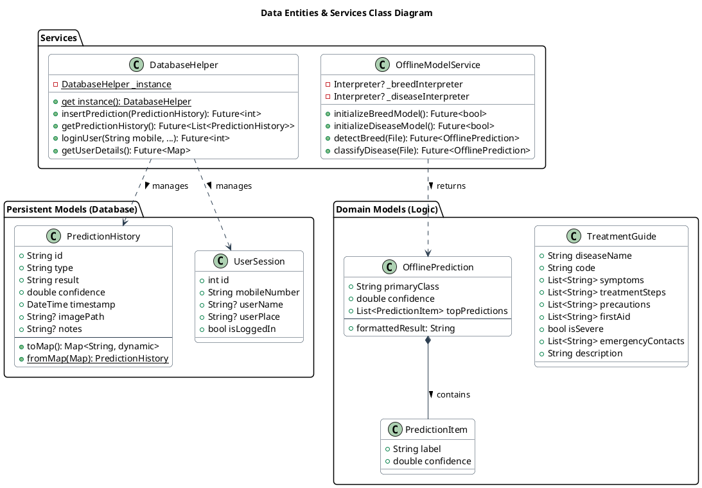
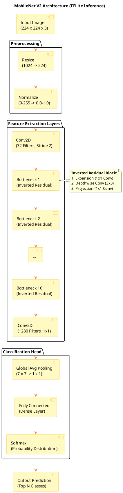

# Model Design

This document covers the **Data Model** (Software Entities & Schema) and the **Neural Network Architecture** (AI Model) used in the PashuSwasthya project.

## 1. Data Model & Services (Class Diagram)

This diagram represents the core data entities, including persistent database models (`PredictionHistory`, `UserSession`) and domain logic models (`TreatmentGuide`, `OfflinePrediction`).

## 2. Neural Network Architecture (MobileNet V2)

The application uses **MobileNet V2** optimized for mobile devices via SQLite/TFLite. The models are quantized and run offline.

**Model Specifications:**
- **Input:** 224 x 224 x 3 (RGB)
- **Framework:** TensorFlow Lite
- **Task:** Multi-class Classification (Breed & Disease)

