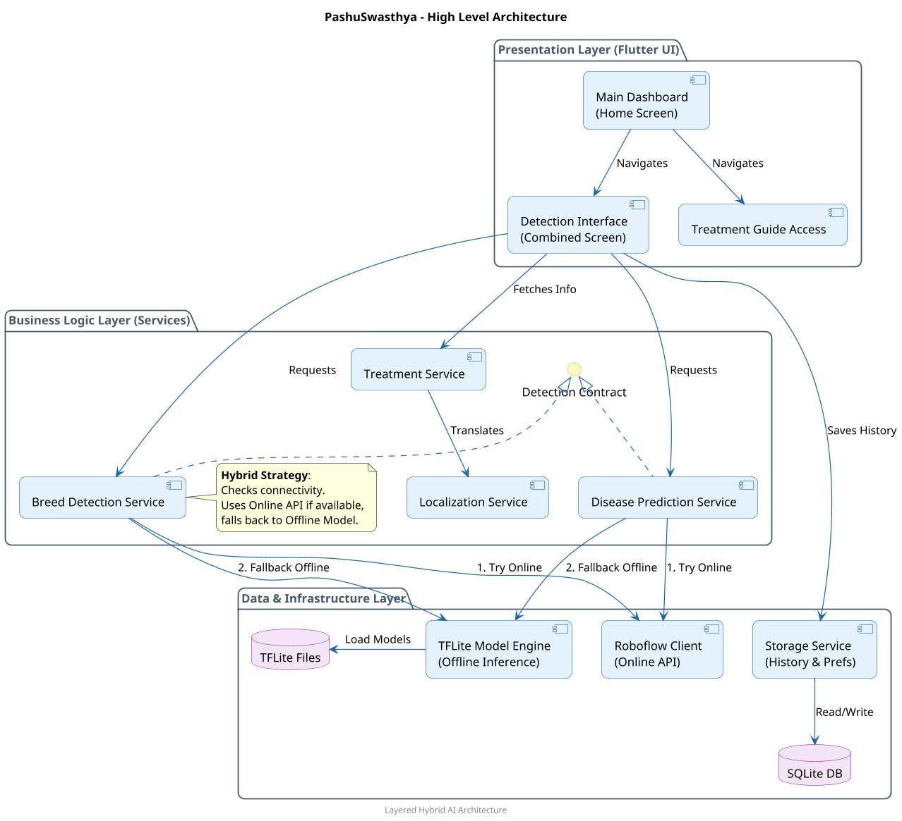
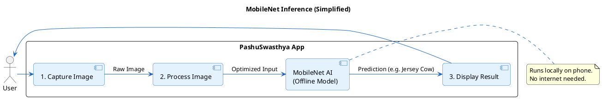
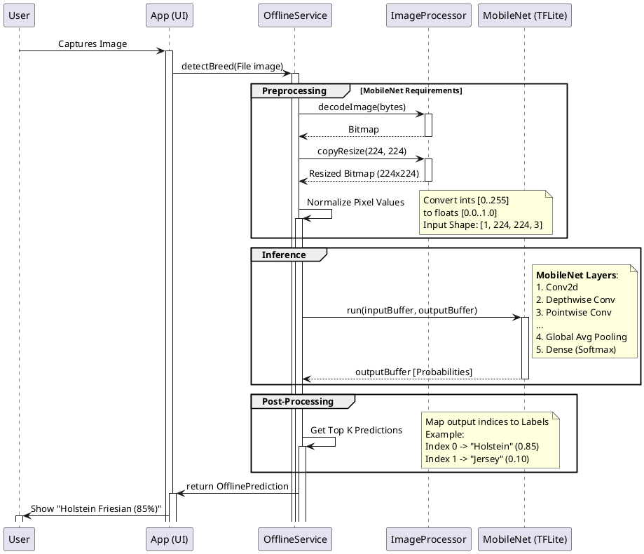

# PashuSwasthya System Architecture

## 1. High-Level System Architecture

The application follows a **Layered Architecture** typical for Flutter applications, featuring a **Hybrid AI Strategy** that falls back to offline MobileNet models when internet connectivity is unavailable.

## 2. MobileNet Inference Pipeline (Offline Mode)

This section details the on-device inference pipeline using **MobileNet V2** via TensorFlow Lite. This pipeline is activated when the app is offline or the Roboflow API is unreachable.

### Inference Sequence Diagram

The data flow during an offline prediction request:

