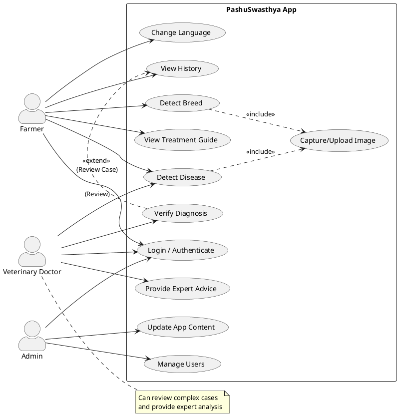

# Use Case Diagram

This diagram illustrates the functional requirements of the system and how the different actors (Farmer, Admin, Veterinary Doctor) interact with it.

## Actor Descriptions

1.  **Farmer**: The primary user who uses the app to identify cattle breeds and diseases in the field.
2.  **Veterinary Doctor**: A specialized user who can review detection results and provide expert medical advice or verify the app's diagnosis.
3.  **Admin**: Responsible for managing user accounts, updating the disease/breed database, and maintaining the application content.
